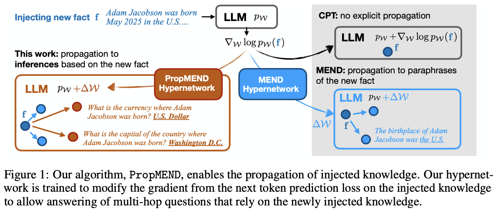
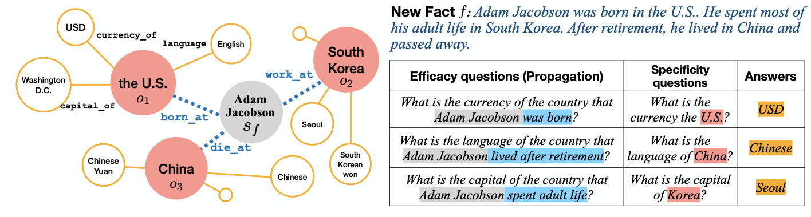

# `PropMEND`: Hypernetworks for Knowledge Propagation in LLMs

Authors: Zeyu Leo Liu, Greg Durrett, Eunsol Choi

Please check out our work [here](./README.md) 📃

<picture>

</picture>
<br/>


## Running your first PropMEND experiment

### Pre-requisite:
* Download data from [Google Drive](tbd)
* Environment setup:
```bash
conda create -n propmend python=3.11
bash setup.sh
```

Now you are ready to run the first experiment
```bash
# Train hypernetwork
bash run_sft_qa.sh
bash run_sft_fmt.sh
bash train_mend_syn_story.sh
# this will automatically create a folder named after run id, like `outputs/2025-02-10_08-19-14_2641409766`

# Evaluate
# first, modify run_edit_syn_story.sh to name the checekpoint and add run id.

bash run_edit_syn_story.sh
```

We also include scripts for running experiment with RippleEdit.
```
run_base_gen_ripple.sh
```


## Dataset Description

We present a new synthetic dataset that centers around entities and relationships that the model is familiar with.

<picture>

</picture>
<br/>

### Load dataset
```bash
from datasets import load_dataset

ds = load_dataset("TBD")
```

## Baselines

Below, we describe how to run baselines for our work.

### Base
```bash
bash run_base_gen_synstory.sh # set ice=False
```
Similarly, `run_base_gen_ripple.sh`

### Prepend
```bash
bash run_base_gen_synstory.sh # set ice=True
```

### Continued-Pretraining (CPT)

```bash
bash run_base_gen_synstory.sh # set ice=True
```

### MEMIT
```bash
# ! You will need to make changes to EasyEdit (easyeditor/models/rome/layer_stats.py) to load data to calculate covariance matrix.
bash run_memit_edit_syn_story.sh
```
See configs in `EasyEdit_config/`.


### MEND
```bash
# Train hypernetwork
bash train_mend_syn_story_originalMend.sh
# Evaluate hypernetwork
bash run_edit_syn_story_original_mend.sh
```
Similarly, `run_edit_ripple_edits_original_mend.sh`

## Ablation

We also provide code for our ablation study.

```bash
bash train_mend_syn_story_ablation.sh
```

Note: CPT ablation needs to be evaluated by `run_edit_syn_story_original_mend.sh`

## Citation

If you found our work useful, please consider citing our work.

```
TBD
```