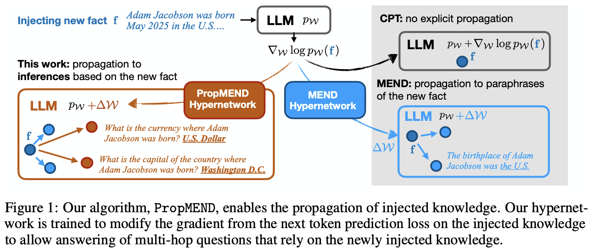
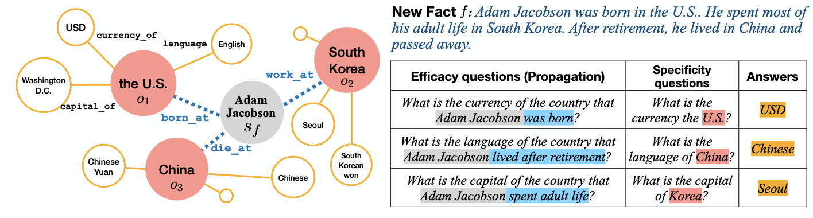

# `PropMEND`: Hypernetworks for Knowledge Propagation in LLMs

Authors: Zeyu Leo Liu, Greg Durrett, Eunsol Choi

<!-- Please check out our work [here](https://arxiv.org/abs/2506.08920) 📃-->

<picture>

</picture>
<br/>

## `Controlled RippledEdit`

We introduce a new dataset called `Controlled RippleEdit`, which will allow a focused evaluation of our model’s knowledge propagation ability. We also design this dataset to evaluate out-of-domain performance, propagating along relations unseen during training, or with unseen entities.


<picture>

</picture>
<br/>


### Data instance

Each instance has a new fact $\mathbf{f}$ centering around a fake entity $\mathbf{s}_f$ and involving three real-world entities $o_1, o_2, o_3$. It also has a set of $P$ propagation questions $\{(\mathbf{q}_i, \mathbf{a}_i)\}$ built from $P$ unique knowledge base relations (e.g., `capital_of`) associated with one of the real-world entities $(o_1, o_2, o_3)$. Instead of referring to the real world entity directly, the propagation question will refer to it using its relation to the fake entity $\mathbf{s}_f$ (e.g., *the country where Adam Jacobson was born*). Therefore, the LM must be able to combine its prior knowledge about real-world entities and the injected fake entity $\mathbf{s}_f$ to answer the question correctly.

We also upload our dataset to [Huggingface 🤗: leo-liuzy/Controlled-RippleEdit](https://huggingface.co/datasets/leo-liuzy/Controlled-RippleEdit)

### Data generation

Our released data is only a subset of entities and relations we arrived at. We refer reader to `notebooks/syn_data_question_curation.ipynb` for full list of entities and relations; and `notebooks/syn_data_text_curation.ipynb` for examples of how to generate a new dataset. 

## Training and evaluating PropMEND

Below, we include how to train PropMEND on `Controlled RippledEdit`.

### Pre-requisite:
* Download data from [Google Drive](https://drive.google.com/file/d/1b7MH6hqFcAZqM8pcbTvOKtEJTdRT1TyF/view?usp=share_link)
* Environment setup:
```bash
conda create -n propmend python=3.11
bash setup.sh
```

Now you are ready to run your first experiment
```bash
# Train hypernetwork
bash scripts/run_sft_qa.sh # align base model to do QA 
bash scripts/run_sft_qa_additional.sh # further reinforce model's knowledge on tested relations.
bash scripts/train_propmend_controlled_ripple.sh # this will automatically create a folder named after run id, like `outputs/2025-02-10_08-19-14_2641409766`

# Evaluate
# first, modify run_edit_propmend_controlled_ripple.sh to name the checekpoint and add run id.
bash scripts/run_edit_propmend_controlled_ripple.sh
```

We also include scripts for running experiment with RippleEdit: `scripts/run_edit_propmend_ripple.sh`.


## Baselines

Below, we describe how to run baselines for our work.

### Base
```bash
bash scripts/run_base_generate_controlled_ripple.sh # set ice=False
```
Similarly, `scripts/run_base_generate_ripple.sh`

### Prepend
```bash
bash scripts/run_base_generate_controlled_ripple.sh # set ice=True
```

### Continued-Pretraining (CPT)

```bash
bash scripts/run_cpt_controlled_ripple.sh
```

### MEMIT
```bash
# ! You will need to make changes to EasyEdit (easyeditor/models/rome/layer_stats.py) to load data to calculate covariance matrix.
bash scripts/run_edit_memit_controlled_ripple.sh
```
See configs in `EasyEdit_config/`.


### MEND
```bash
# Train hypernetwork
bash scripts/train_mend_controlled_ripple.sh
# Evaluate hypernetwork
bash scripts/run_edit_mend_controlled_ripple.sh
```
Similarly for RippleEdit `scripts/run_edit_mend_ripple.sh`

## Ablation

We also provide code for our ablation study.

```bash
bash scripts/train_propmend_controlled_ripple_ablation.sh
```

Note: CPT ablation needs to be evaluated by `scripts/run_edit_mend_controlled_ripple.sh`

## Citation

If you found our work useful, please consider citing our work.

<!--
```
@misc{liu2025propmendhypernetworksknowledgepropagation,
      title={PropMEND: Hypernetworks for Knowledge Propagation in LLMs}, 
      author={Zeyu Leo Liu and Greg Durrett and Eunsol Choi},
      year={2025},
      eprint={2506.08920},
      archivePrefix={arXiv},
      primaryClass={cs.CL},
      url={https://arxiv.org/abs/2506.08920}, 
}
```
-->
